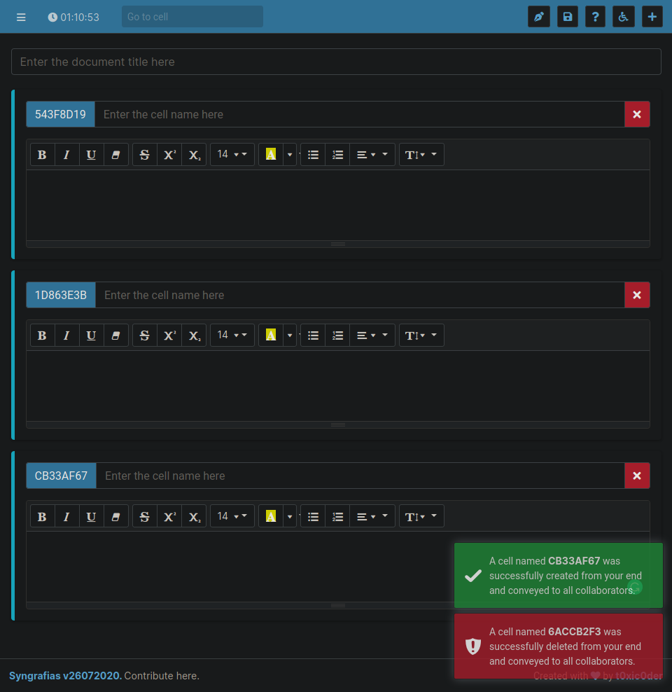

<h1 align="center">syngrafias</h1>

A free and open-source synchronized authorship web-application for seamlessly collaborating on documents using intuitive cells

    
    
    
    

## Introduction

    Syngrafias was born to address the need of a perfect document editing platform which could be collaborative, synchronous and non-intrusive at the same time. So we picked the best features of available technologies (like Jupyter Notebook and Google Docs) and put them together to build this beauty.

## Features
- Active synchronization of changes to all connected clients editing the same workspace document
- Unintrusive and focused editing with intuitive cells - Allot one per user to make untouched tracking
- Decentralized document versioning implemented by-design with unsynchronized editing and saving
- Custom format for retaining changes made in the document - Syngrafias Workspace Document (SWD)
- Support for exporting workspace documents to widely used formats like PDF, DOCX and ODF is coming soon
- Easy and flexible activity logging to keep track of changes made by connected peers in document
- Ultralight implementation of workspace server with slimmed requests - Approx. 2MB over Python runtime
- Decoupled WebSockets server to facilitate better system utilization and functional parallelism
- Accessible across the internet with both IPv4 and IPv6 access modes for workspace and WebSockets servers
- State-of-the-art session management with workable responsiveness for relatively smaller displays

## Usage
COMING SOON

## Screenshots
[Head over to this page](https://github.com/t0xic0der/syngrafias/wiki/Screenshots)

## Contribute

You may request for the addition of new features in the <a href="https://github.com/t0xic0der/syngrafias/issues">issues</a> page but as the project is singlehandedly maintained - it might take time to develop on them. Please consider forking the repository and contributing to its development. :heart:

