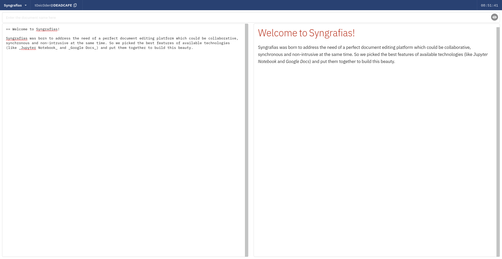
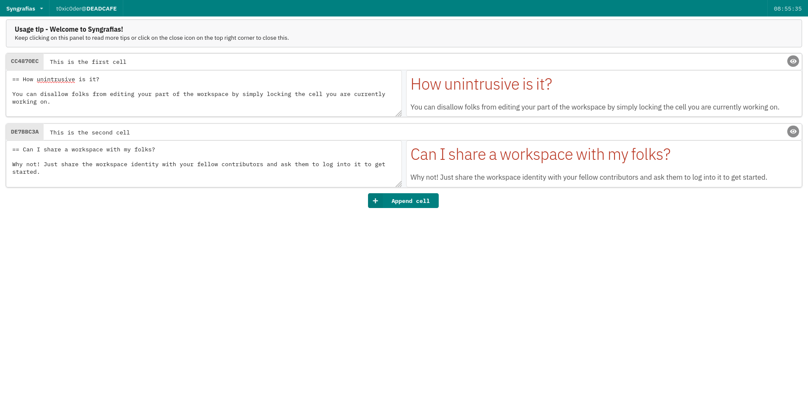

<h1 align="center">syngrafias</h1>

    A free and open-source synchronized authorship service for seamlessly collaborating on documents using workspaces 
    and intuitive cells

    
    
    
    

## Introduction

    Syngrafias was born to address the need of a perfect document editing platform which could be collaborative, 
    synchronous and non-intrusive at the same time. So we picked the best features of available technologies (like 
    Jupyter Notebook and Google Docs) and put them together to build this beauty.

    Be it documentation authorship or note making for a discussion, you could easily make use of the <i>Unity Mode</i> 
    or the <i>Cellular Mode</i> as you see fit and share the workspace identity with your folks to invite them to 
    collaborate with you as well in real time. Every activity is monitorable, logged and conveyed at all times

## Features
- Active synchronization of changes to all connected clients present in the same workspace
- Unintrusive and focused editing with _Cellular Mode_ - Allot one per user to make untouched tracking
- Unified documentation authorship using a _Unity Mode_ for collaborating edits on single document
- Decentralized document versioning implemented by-design with unsynchronized editing and saving
- Out-of-the-box support for AsciiDoctor live rendering and preview in both _Cellular Mode_ and _Unity Mode_
- Custom format for retaining changes made in the cellular workspace - Syngrafias Workspace Document (SWD)
- Standard format for retaining changes made in the unity workspace - AsciiDoctor Document (ADOC)
- Support for exporting workspace documents to widely used formats like PDF is coming soon
- Support for Markdown live rendering and preview in both _Cellular Mode_ and _Unity Mode_ is coming soon
- Easy and flexible activity logging to keep track of changes made by connected peers in document
- Ultralight implementation of workspace server with slimmed requests - Approx. 2MB over Python runtime
- Decoupled WebSockets server to facilitate better system utilization and functional parallelism
- Accessible across the internet with both IPv4 and IPv6 access modes for workspace and WebSockets servers
- State-of-the-art session management with user accounts bound to a certain workspace
- Workspace is themeable with nine distinct accent colours to choose from

## Contents
1. [Home](https://github.com/t0xic0der/syngrafias/wiki/Home)
2. [Usage](https://github.com/t0xic0der/syngrafias/wiki/Usage)
3. [Screenshots](https://github.com/t0xic0der/syngrafias/wiki/Screenshots)

## Contribute

    You may request for the addition of new features in the 
    <a href="https://github.com/t0xic0der/syngrafias/issues">issues</a> page but as the project is singlehandedly 
    maintained - it might take time to develop on them. Please consider forking the repository and contributing to its 
    development. :heart:

